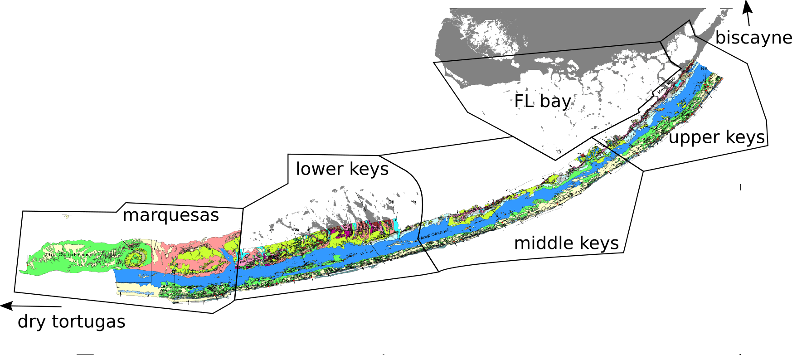

# fk-iea
Infographic created via collaboration between the Florida Keys National Marine Sanctuary (FKNMS), the Florida Keys Integrated Ecosystem Assessment (IEA), and the Marine Biodiversity Observation Network (MBON).

An overview map of the FL Keys (mockup below) is used as a landing page.


Each region "box" in this graphic will be a clickable element which leads to an infographic representing that region.

## Basic Development Workflow
Edits can be made directly on the github website so no setup is required.

The basic development workflow is:

1. edit files
2. wait for your changes to be built and deployed to the website

This easily-accessible workflow has some drawbacks though:
* waiting for the site to build can be tedious
* typos and other tiny errors won't be caught until the site builds
* only one file can be edited per commit, and the github editor isn't perfect.

For these and other reasons, you may want to consider the "advanced dev workflow" below.

## Directory Layout
Wondering which files to edit?
This section explains which files are most important and how to make specific changes.

### Basic Content
Firstly: `.md` and `.Rmd` files are the basic building block of the site.
These files are in the `./content` directory and editing them is a great way to get started.
These files use markdown syntax with embedded, executed R and python chunks.

### Editing the infographic image
The infographic image is a `.svg` image and can be edited with Inkscape.
The only special thing about this `.svg` file is the element id property of clickable items.

### Connecting content to infographic
`./modal_plots.csv` connects image elements from `/docs/svg/` to modal content in `./docs/modals/` using the `modal_id` column.
Values in the `modal_id` column must match to the element id property in the `.svg`.

### Main Menu Links & Other Global Config
`config.toml` contains the main menu and other global config info.

## Advanced Dev
This site is built with bookdown and deployed as a static file website.

### Install blogdown & hugo [[ref](https://bookdown.org/yihui/blogdown/installation.html)]
```r
if (!requireNamespace("devtools")) install.packages("devtools")
devtools::install_github("rstudio/blogdown")
blogdown::install_hugo()
# verify installation:
blogdown::hugo_version()
```

### Workflow
1. edit files
2. test build of the site using [blogdown's RStudio addins](https://bookdown.org/yihui/blogdown/rstudio-ide.html) or by running `blogdown::serve_site()`

## additional links
Based on the example at https://github.com/ioos-eco/cinms.
