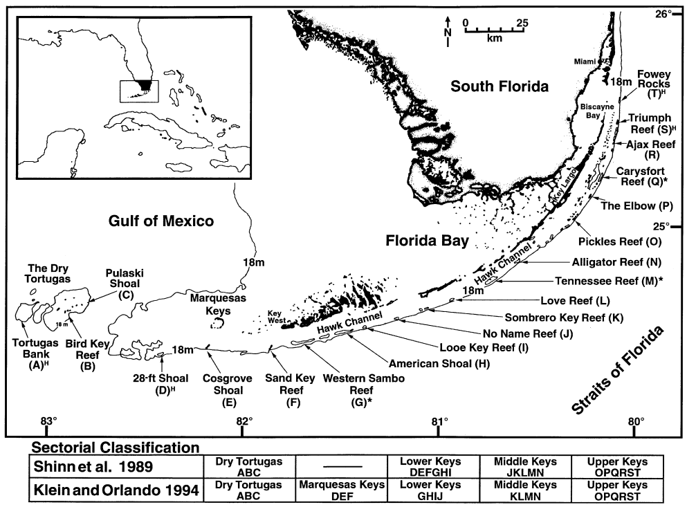
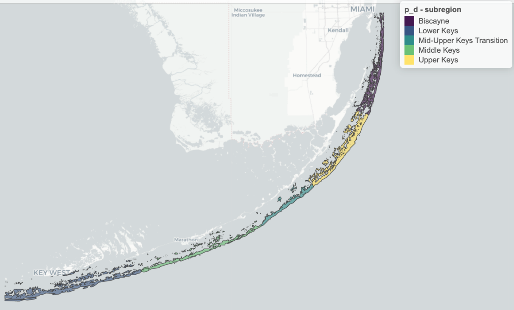
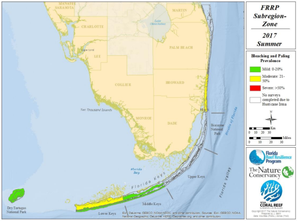
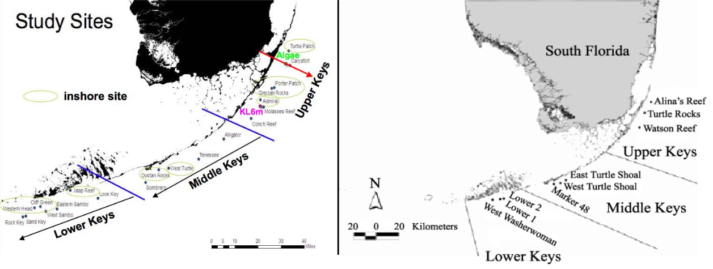
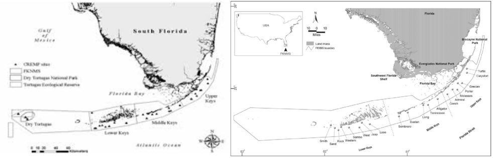
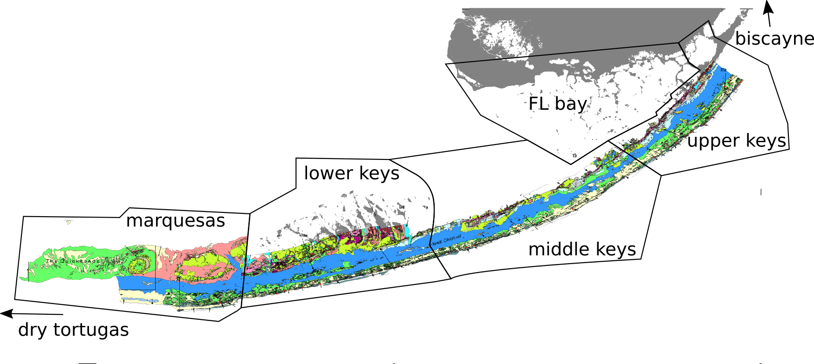

The Florida keys are often split into sub-areas.

## examples
Below are some examples subdivisions of the FK region.

Coral reefs and their subregional classification defined by [T. J. T. MurdochR. B. Aronson's *"Scale-dependent spatial variability of coral assemblages along the Florida Reef Tract"*, published
 1999](https://link.springer.com/article/10.1007/s003380050210).

Plot of region labels in RVC data used by @mhepner90 in her [dissertation RVC analysis](https://github.com/mhepner90/RVC/blob/master/map_regions.Rmd) and presented in the [info-fk corals infographic](https://marinebon.github.io/info-fk/corals.html).

------------------------------------------------------------------------------

"One Fish, Two Fish, Red Fish, Blue Fish" presentation by Kenneth Hicks

------------------------------------------------------------------------------

* "Florida Reef Resilience Program Disturbance Response Monitoring and Hurricane Irma Rapid Reef Assessment Quick Look Report: Summer 2017"

------------------------------------------------------------------------------

* FL FWC - Vessel Use in the Florida Keys National Marine Sanctuary

------------------------------------------------------------------------------

* left: "3 Colored Dissolved Organic Material Increases Resiliency of Coral Reefs by Controlling Exposure to UV"
* right: "Coral recruitment patterns in the Florida Keys.Coral recruitment patterns in the Florida Keys"

------------------------------------------------------------------------------

* left: "Distribution, Abundance and Volume of Xestospongia muta at Selected Sites in the Florida Keys National Marine"
* right: "Phase-shift in coral reef communities in the Florida Keys National Marine Sanctuary (FKNMS), USA"

------------------------------------------------------------------------------

Based on the above examples, the following mockup was prepared as an overview of the areas:

