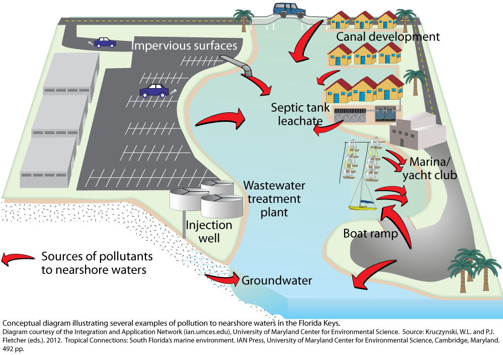
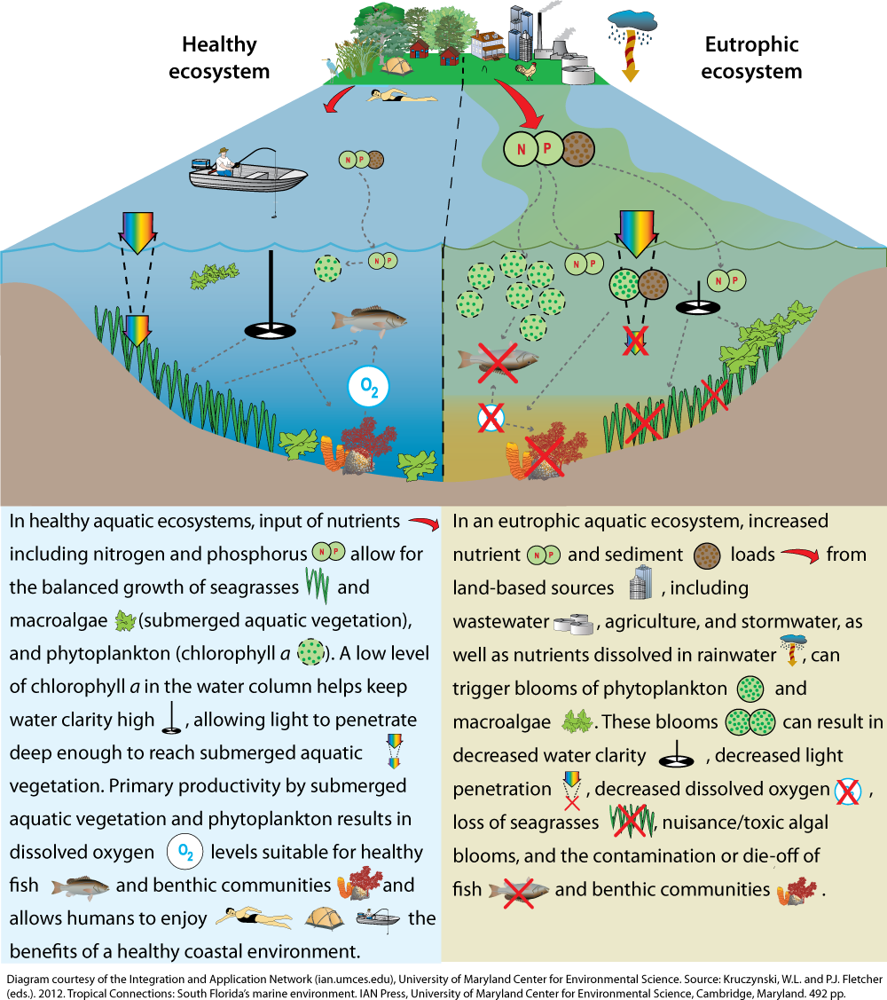

## Number of Housing Units with Wastewater Connection
https://drive.google.com/open?id=1xrGz0LS0LydjnynlOJdp-65pfaH2bXcC

## Beach Closures due to Fecal Indicator Level
https://drive.google.com/open?id=1lk_RXsGzg0z0lyeoIA5YRDTn_KwX8pJM

https://drive.google.com/open?id=1dD0yiSW9ApvaqwEbwr00ovbCCfC2_P-H
