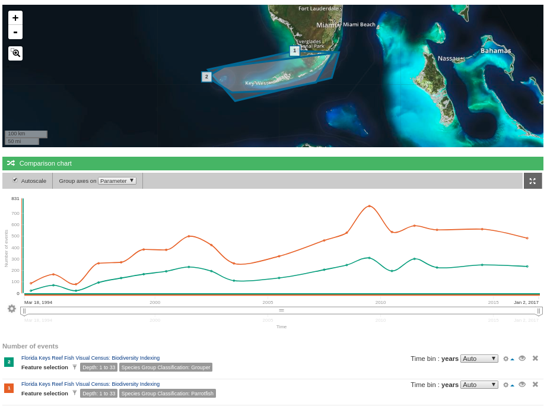

```{r imports for targeted vs non, include=FALSE}
library(tidyverse)
library(leaflet)
library(plyr)

source("./../obis_cache.R")
source("./../obis_plot_comparison.R")
```

# Indicators:
## Fish abundance, diversity, size and species
Relevant analysis in 2018 from @mhepner presented in the [FKNMS infographic](https://marinebon.github.io/info-fk/corals.html).

TODO: Raw RVC data used in that analysis is accessible via [sefsc.noaa.gov](https://grunt.sefsc.noaa.gov/rvc_analysis20/).

### Snapper/grouper vs parrotfish (targeted/non-targeted)
#### MBON IOOS Portal
The [MBON IOOS Portal](https://mbon.ioos.us) was used to create a data view comparing [Reef Visual Census data](https://mbon.ioos.us/#metadata/53cb8d58-ae4d-43e1-aea3-640db9491db2/875de156-d933-4373-bb09-486c25eccfb2) for grouper and parrotfish.
A screenshot of the resulting view updated last on 2019-06-19 is below:



TODO: How to link, share, or embed this data view?

#### R and python plots data directly from OBIS
```{r region vars}
fk_nms_wkt <- "POLYGON ((-83.15 25.65, -80.066667 25.65, -80.066667 24.3, -83.15 24.3, -83.15 25.65))"
```

```{r fetch scaridae data}
scaridae_species <- "Scarus iseri"
scaridae_name_safe <- sanitize_query_id(scaridae_species)
if (has_cache(scaridae_name_safe)){
    scaridae_occurrence <- load_cache(scaridae_name_safe)
} else {
    scaridae_occurrence <- robis::occurrence(
        scaridae_species,
        geometry = fk_nms_wkt
    )[c('eventDate', 'species', 'occurrenceStatus')]
    save_cache(scaridae_name_safe, scaridae_occurrence)
}
# write.csv(scaridae_occurrence, "scaridae_occurrence.csv")
```

```{r fetch lutjanidae data}
lutjanidae_species <- "Ocyurus chrysurus"
lutjanidae_name_safe <- sanitize_query_id(lutjanidae_species)
if (has_cache(lutjanidae_name_safe)){
    lutjanidae_occurrence <- load_cache(lutjanidae_name_safe)
} else {
    lutjanidae_occurrence <- robis::occurrence(
        lutjanidae_species,
        geometry = fk_nms_wkt
    )[c('eventDate', 'species', 'occurrenceStatus')]
    save_cache(lutjanidae_name_safe, lutjanidae_occurrence)
}
```

```{r merge occurrences and save}
# write.csv(lutjanidae_occurrence, "lutjanidae_occurrence.csv")
occurrences <- rbind(
    scaridae_occurrence, lutjanidae_occurrence
)
occurrences$occurrenceStatus <- plyr::revalue(
    occurrences$occurrenceStatus,
    c("present"=1)
)
write.csv(occurrences, "occurrences.csv")
```

```{r map the data, echo=FALSE}
# TODO: how to make this one map?
# temp disabled b/c there are too many points
#robis::map_leaflet(scaridae_occurrence)
#robis::map_leaflet(lutjanidae_occurrence)
```

```{r timeseries, echo=FALSE}
obis_plot_comparison(scaridae_occurrence, lutjanidae_occurrence)
```

```{python compare occurrence data, eval=F}
from plo7y.reporters.ts_compare import ts_compare
ts_compare(
    "occurrences.csv",
    x_key="eventDate",
    y_key="occurrenceStatus",
    y_group_by_key="species",
)
```

TODO: Lobster size structure study [Not RVC data; not continuing to be collected so not for automation]
