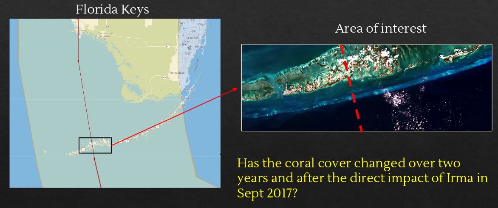

# Two years of coral cover change in Florida Keys (2017-2019): Effects of Hurricane Irma?

Has the coral cover changed over two years and after the direct impact of Irma in Sept 2017?

## study area:

## methods:

Classification is confounded by turbid waters.
To improve classification, a depth filter was applied.

## Results:

* FEB 2017: 77.33 km2
* FEB 2019: 58.85 km2 (13.83 km2 new)
* Total loss:18.48 km2  (23.9%); equals to 5.4 Central Parks NY
* Coral reef cover showed an important decrease, but not attributable to the hurricane only

# Conclusions

Benthic mapping can help us to measure and visualize changes in ecosystems
Classifications are not perfect, it require clean satellite images (free of clouds, turbidity and sun glint). Some spectral signatures can be confused.
In situ data (bathymetry, observations, cover) greatly improve benthic mapping
