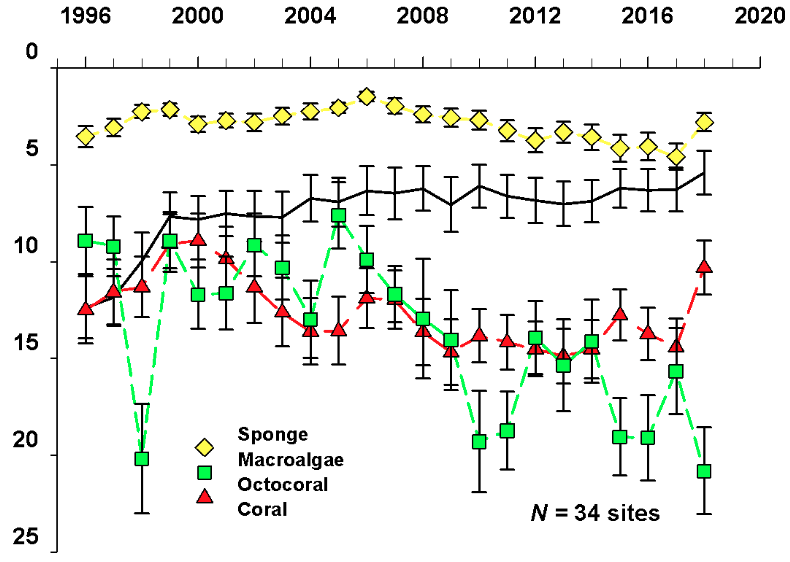
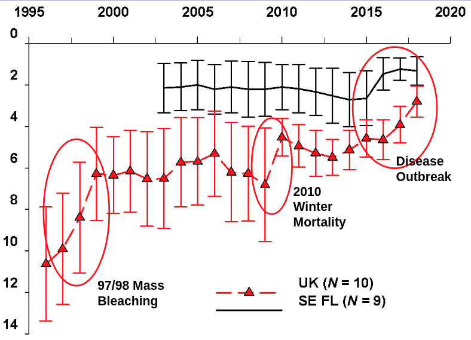

## Habitat
Benthic community composition is changing.
Disease and bleaching are influential.

<!--
TODO: metrics, by taxa, over time, by reef type (i.e., patch, bank)
-->

### Coral Cover
Coral Cover has been decreasing due to events and is unable to recover due to continuous stressors.
This decline over recent decades is easily visible in the following graphs from
[9B-Ruzicka WQPP Presentation_ May 2019.pptx](https://drive.google.com/open?id=181OYdxt0sXZYVNqz41f6m9KZQMdS2Ex0):





<!--

#### By Reef Type
TODO: CREMP (LM will categorize sites by reef type):

#### By Coral Type
TODO: Coral cover by species (Coral decreased)

### Macro-algae
TODO: Macro-algae cover (Algae increased)

### Gorgonian
TODO: Gorgonian cover (Gorgonian increased)

### Sponge
TODO: Sponge (in flux)

### Mangrove
TODO: Mangrove. data: [Global Mangrove Watch (1996 - 2016)](http://data.unep-wcmc.org/datasets/4)

### Seagrass
TODO: Seagrass

-->

# FKNMS Sub-regions
In many analyses it makes sense to split the Florida Reef Tract into sub-regions [[T. J. T. MurdochR. B. Aronson
 1999](https://link.springer.com/article/10.1007/s003380050210)].
The regional subdivision of the reef tract is not well standardized, however.
The definition of the subregions used here and an explanation of this choice is discussed on the [fk-subdiv page](fk-subidv.md).


----------------------------------------------------------------------------

Florida Fish and Wildlife Conservation Commission's richness of potential habitat for selected focal species in Florida [[ref]](https://flcpa.databasin.org/datasets/4372d400ff8444719c86175000ed7de8):

<!-- TODO: make ESRI map work
```{r FWC richness potential, echo=FALSE, exec=FALSE}
blogdown::shortcode("esri_map",
    map_id="fwc-map",
    lat="24.8", lon="-81", zoom="8",
    basemap="Gray",
    feature_url="https://www.sciencebase.gov/arcgis/rest/services/Catalog/564f49fde4b064dd1d095637/MapServer/"
)
```
-->

----------------------------------------------------------------------------

Most of FKNMS was classified as "highest priority" by the 2006 [Florida Critical Lands and Waters Identification Project Database](Florida Critical Lands and Waters Identification Project Database)

<!-- TODO: make ESRI map work
```{r FCLIP map, echo=FALSE, exec=FALSE}
blogdown::shortcode("esri_map",
    map_id="clip-map",
    lat="24.8", lon="-81", zoom="8",
    basemap="Gray",
    feature_url="https://www.sciencebase.gov/arcgis/rest/services/Catalog/564b4250e4b0ebfbef0d31c1/MapServer/"
)
```
-->

----------------------------------------------------------------------------

FWC's [Landcover classes for CLIP 1-2 levels](https://flcpa.databasin.org/datasets/4befbffb3ec0492aa890297c4b4abc33):

<!-- TODO: make ESRI map work
```{r Landcover classes map, echo=FALSE, exec=FALSE}
blogdown::shortcode("esri_map",
    map_id="landcover-map",
    lat="24.8", lon="-81", zoom="8",
    basemap="Gray",
    feature_url="https://www.sciencebase.gov/arcgis/rest/services/Catalog/57039d72e4b0328dcb81dddf/MapServer/"
)
```
-->

## Seascapes
Spring SeaScapes Descending 2019-2009:
%5D%5B(22.0):(28.0)%5D%5B(-85.0):(-79.0)%5D&.draw=surface&.vars=longitude%7Clatitude%7CCLASS&.colorBar=%7C%7C%7C%7C%7C&.bgColor=0xffccccff)
%5D%5B(22.0):(28.0)%5D%5B(-85.0):(-79.0)%5D&.draw=surface&.vars=longitude%7Clatitude%7CCLASS&.colorBar=%7C%7C%7C%7C%7C&.bgColor=0xffccccff)
%5D%5B(22.0):(28.0)%5D%5B(-85.0):(-79.0)%5D&.draw=surface&.vars=longitude%7Clatitude%7CCLASS&.colorBar=%7C%7C%7C%7C%7C&.bgColor=0xffccccff)
%5D%5B(22.0):(28.0)%5D%5B(-85.0):(-79.0)%5D&.draw=surface&.vars=longitude%7Clatitude%7CCLASS&.colorBar=%7C%7C%7C%7C%7C&.bgColor=0xffccccff)
%5D%5B(22.0):(28.0)%5D%5B(-85.0):(-79.0)%5D&.draw=surface&.vars=longitude%7Clatitude%7CCLASS&.colorBar=%7C%7C%7C%7C%7C&.bgColor=0xffccccff)
%5D%5B(22.0):(28.0)%5D%5B(-85.0):(-79.0)%5D&.draw=surface&.vars=longitude%7Clatitude%7CCLASS&.colorBar=%7C%7C%7C%7C%7C&.bgColor=0xffccccff)

For more see relevant section on the [IMaRS Gulf of Mexico Grafana Dashboard](http://grafana.marine.usf.edu:3000/dashboard/db/gulf-of-mexico?orgId=2&from=now-10y&to=now)
